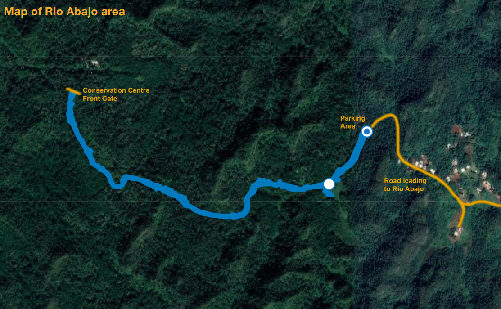
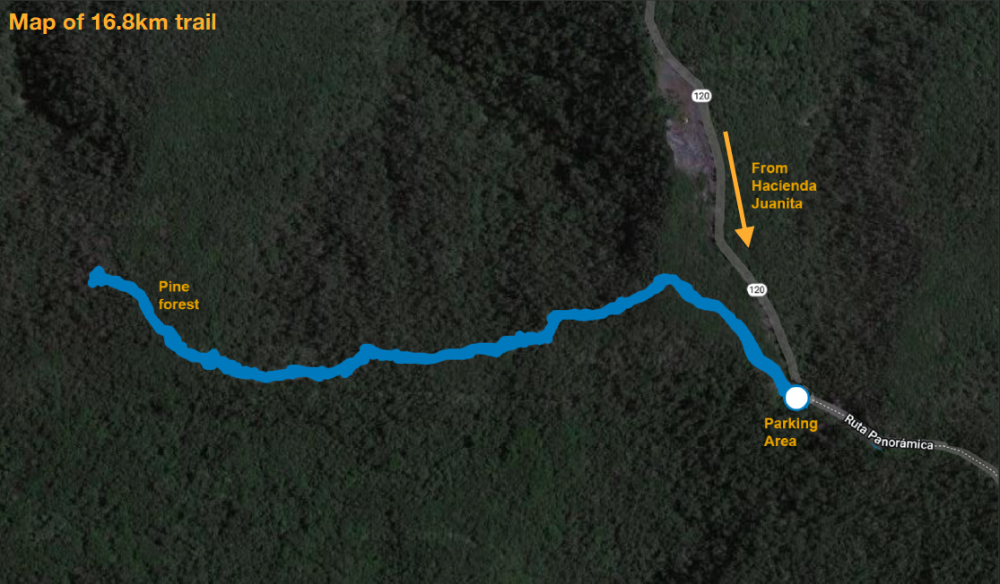
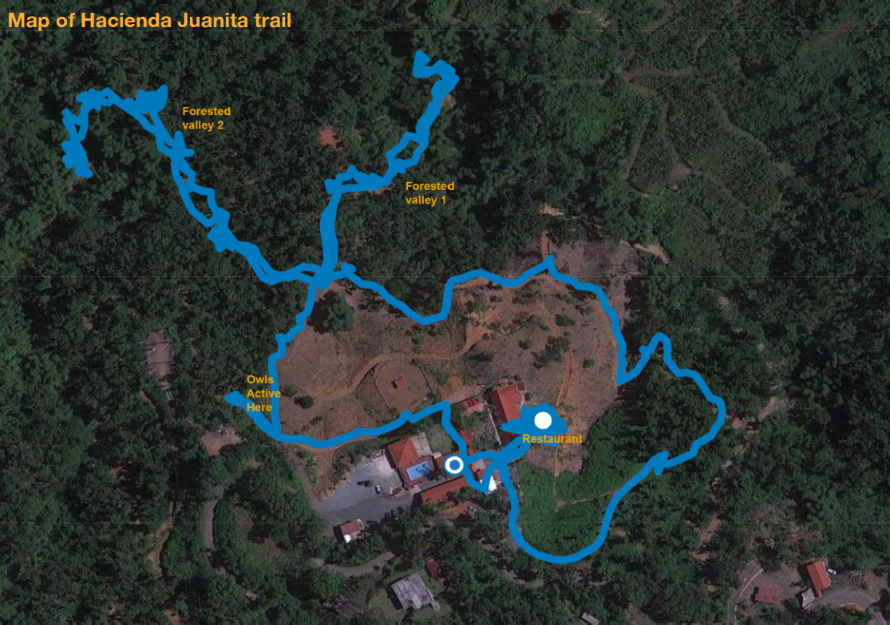
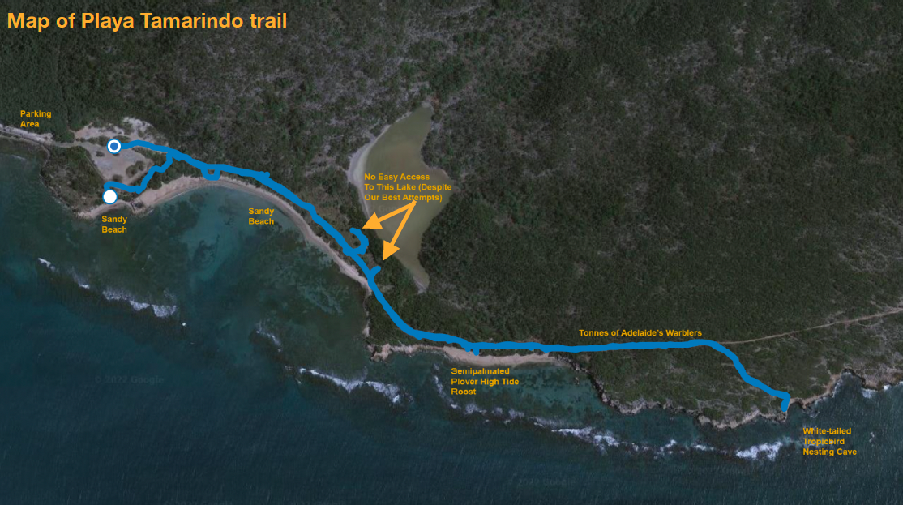
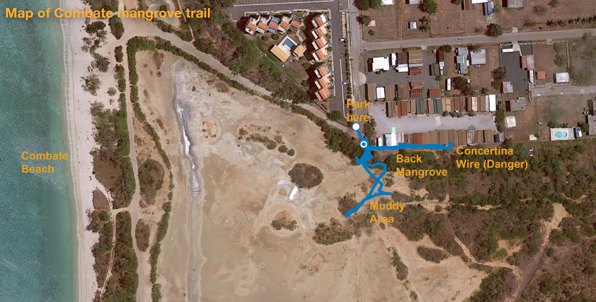
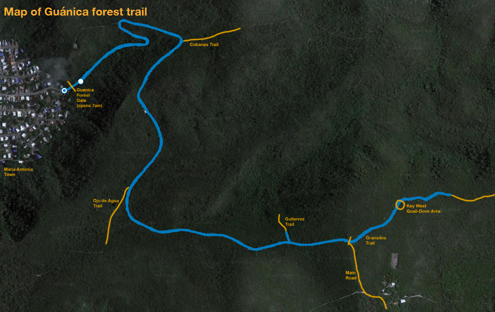

## Puerto Rico Trip Report (14-20 March 2022) -- David Tan and Sam Hamer

### Day 1 (14 March 2022): Bosque Cambalache + Hacienda Esperanza

Arriving at San Juan airport at 10:30am in the morning, I (David) waited for Sam to arrive at around noon, ticking an easy Greater Antillean Grackle and Feral Pigeon in the immediate airport vicinity (note that San Juan airport does not have free wifi). After we’d both arrived in San Juan, we took a shuttle to our car rental pickup and immediately drove to Bosque Cambalache forest (18.452381, -66.597009) to get ourselves oriented to what the Puerto Rican forest had to offer. 

At Cambalache we found a decent secondary forest habitat (lots of exotic plants from Southeast Asia), with an easy hiking trail and good potential for lowland forest interior species. Right at the carpark we were greeted by several Grey Kingbirds and the calls of quite a few Mangrove Cuckoos. Since both of us were new to the Caribbean, we also soon learned that Bananaquits are pretty much ubiquitous all across Puerto Rico, and their cicada-like calls can be heard almost anywhere. We arrived on site at around 3:30pm, not expecting much activity, but we were nonetheless able to tick our first two endemics in short order: the Puerto Rican Bullfinch (rather misnamed since it’s not actually a bullfinch and is instead the only endemic true tanager on the island), and a bold Puerto Rican Lizard-Cuckoo futzing around the understorey close to eye-level along the forest trail. It’s worth noting that while some websites claim that Bosque Cambalache is closed on Mondays, that did not seem to be the case for us and we were able to enter the site freely. 

After spending about 2hrs at Cambalache, and with not much more daylight left to go, we drove on to Hacienda Esperanza to check the place out, ticking a surprisingly scarce White-crowned Pigeon on a power line just outside Cambalache. The Hacienda itself is closed on Mondays and Tuesdays, but the area surrounding the Hacienda is vast and encompasses several different habitat types, so it’s definitely worth spending some time in. We wanted to try for some coastal species, so we headed towards the beach area. Unfortunately, the trail towards the beach (Playa la Esperanza beach) closes at 6pm, and there are park officers who will very politely ask you to leave so they can lock up the carpark for the night, so we were only able to walk about 250m along the trail before we had to leave, although we did have a good Look at a Scaly-naped Pigeon in the undergrowth along the trail (alongside the incessant calls of Bananaquit) on the way out. 

After a disappointing dinner at the nearby Barceloneta outlet mall, we drove to our lodging at [Casa de Campo Rio Arriba](https://www.booking.com/hotel/pr/bo-rio-arriba-sect-canina-1carr-10km70.html) (18.348436, -66.666539), so chosen because of its proximity to the Rio Abajo forest, probably the best site for seeing the endemic and critically endangered Puerto Rican Parrot. Unfortunately, because the default search hit on Google Maps led to a completely nonsensical location, we spent quite a bit of time getting lost in the middle of nowhere, but eventually managed to locate the accommodation down a long steep drive on a very narrow road, in a river valley just north of the Dos Bocas hydroelectric dam. We also ticked our first Red-legged Thrush on the road near the casa in the middle of the night, our first of many Red-legged Thrushes on this trip. 

### Day 2 (15 March 2022): Rio Abajo + Maricao

Setting off before dawn, we made the short drive from our accommodation to the Rio Abajo forest to try for the Puerto Rican owl before it got light. For those using information from birdfinding.info to navigate to the site, note that you have to drive beyond the marker on the website onto a very narrow road to a spot that ends with 2 closed gates (around 18.331035, -66.706410). The gate on the right leads to a campground and other gate leads to the parrot conservation centre. Park along the side of the road but do not block either entrance; there are rangers around who will politely ask you to shift your car if it’s an obstruction. The state forest appears to be slightly more mature secondary forest than Cambalache, but still containing lots of non-native vegetation such as Pandanus sp. The Puerto Rican Owls were vocal but shy, and eluded our best attempts to see them. We also bumped into fellow world birders Noam and Oz, whom we would later encounter again several times during this trip. The winding trail from the parking area to the front gate of the parrot conservation centre is relatively short and not very steep, and along the way we encountered several Puerto Rican Vireos and Puerto Rican Bullfinches, all of which were calling loudly. Puerto Rican Todies also turned out to be incredibly common once we learnt the calls, but photographing them can sometimes be devilishly difficult. Along the trail we definitely heard several Puerto Rican Parrots fly overhead, but seeing them perched was a real challenge. Both Noam and Oz were able to photograph one parrot perched in a bare tree, but the bird flew off seconds before we arrived on site. It seems like the likelihood of seeing a parrot increases the closer one gets to the parrot conservation centre, and we finally had a clear view of six birds flying overhead while standing right in front of the conservation centre’s main gate (18.332546, -66.717501; entrance to the conservation centre is strictly prohibited). We spent about 5hrs birding Rio Abajo in total and left around noon, making a short detour to Utuado for lunch (mofongos with creole sauce), before making the long 1hr 40min drive to the highlands of Maricao.

Maricao sits in the peaks of the Cordillera Central, a mountain range that essentially bisects Puerto Rico from east to west, and is where most of the island’s montane species can be found. We arrived at our accommodation — the [Hacienda Juanita](https://haciendajuanitapr.com/) (18.178793, -66.992986) — and checked in around 3:30pm. Contrary to some reports, the Hacienda was indeed open for business, although we discovered rather to our chagrin that there was no available wifi at the resort despite the booking website saying otherwise, because they were “changing internet providers”. Whether this situation will change anytime soon remains uncertain (reviews dating back 4 months ago indicate that the wifi wasn’t working then too). There is also a restaurant on-site, but they are not open for lunch and close at 7pm with last orders at 6pm; not a big problem with the main birding sites only a 10-ish minute drive away. After checking in to our room we immediately set out for the trail at the 16.8km road marker (18.156708, -66.997682), a short 8min drive from the Hacienda Juanita. This trail is about 1km long, runs along a narrow ridge, and incredibly birdy. Because of the narrowness of the ridge, most of the bird activity along the trail will be concentrated in a very thin strip of vegetation on either side of the trail, making birds highly visible and easy to spot. Our short evening stroll along the trail, where we made it less than halfway to the end, gave us spectacular views of Puerto Rican Woodpecker, Puerto Rican Tanager (not actually a tanager, but a member of its own family Neospingidae), and Puerto Rican Spindalis, all in the late afternoon. As ever, Puerto Rican Bullfinch and Bananquit were bloody everywhere. Todies were also super common and vocal along the ridge. 

After birding the 16.8km trail we returned to the Hacienda restaurant for dinner and birded from the restaurant’s veranda overlooking a small coffee plantation. Pearly-eyed Thrashers and Grey Kingbirds were highly visible from this overlook. However, our biggest surprise as we were about to turn in for the night was hearing multiple Puerto Rican Owls calling from outside our room (sounding like off-brand Laughing Kookaburras), so we dashed out with torches and headlamps ablaze and walked along the Hacienda trails to a small corner where the owls were actively calling from, and finally managed some fantastic views of the birds after they eluded us earlier in the morning at Rio Abajo. From our rough count, there were at least 4 owls living in the forest patch inside the Hacienda, and they appeared to be hunting in the coffee plantation at night. 

Our elation that evening was marred only by the very porous nature of the Hacienda room walls and our neighbours’ rather inconsiderate habit of leaving their TV on at full blast all night, which made for a rather uncomfortable sleeping experience. 

### Day 3 (16 March 2022): Maricao + Susúa

Despite not getting much rest the night before, we drove out at dawn to the 16.8km trail again and walked the entire trail from start to finish. The first 300m of the trail was largely uneventful but things began to kick off around the 400m point with the appearance of our first confirmed Green Mango of the trip, hovering about 1m above our heads feeding on some pink flowers. At around the 600m mark we had our first potential sighting of the highly sought-after endemic Elfin Woods Warbler, which flew across the trail into a tree for a couple of seconds, allowing Sam a quick but inconclusive view of the bird, before flying off. Another 100m later, another small passerine popped into a tree just beside the trail, and this time both of us were able clap eyes on the bird and confirm its identity as an Elfin Woods Warbler. This bird didn’t stick around for very long either, but another 100m later we found our third (!) Individual, and this one stuck around long enough for us to snap some downright terrible (but nonetheless identifiable) photographs. Near the end of the trail, just before the vegetation changes into pine forest habitat, we encountered yet another Puerto Rican Lizard-Cuckoo, and one that was more than happy to take its time getting across from one side of the ridge to the other. 

After completing the 16.8km trail, we attempted to bird the main visitor centre area at the 16.1km marker, but it started to rain so we ended up adjourning back to the Hacienda for breakfast, which turned out to have been the correct decision since we ended up getting great views of a pair of Puerto Rican Orioles in the large mango tree just outside the restaurant verandah, yet another endemic added to the trip list. It’s worth noting at this point that after having spent 2-ish days in Puerto Rico, we began to realise that food service in Puerto Rico tends to follow… island time, so it’s generally advisable to find food places from which some birding can be accomplished. 

After breakfast, realising we hadn’t birded the Hacienda property properly, we went on a short walk around the Hacienda trails, starting out at the eastern end of the coffee plantation. A quick stroll through the more open habitat led to good views of Puerto Rican Spindalis, loads of Bananaquit, and one Northern Parula. Venturing deeper into the forested valley gave us good views of nesting Lesser Antillean Pewee as well as eye-level views of a pair of Puerto Rican Emeralds. The forest area also appears to be rich in understorey species such as vireos and bullfinch. No luck, however, with the Antillean Euphonia despite our best efforts. 

After lunch, gripped by a (misplaced) fear of missing the Adelaide’s Warbler, we drove down to Susúa to try our luck at a site where at least 15 individuals were recently seen. In contrast to the cool and verdant highlands, the south side of Puerto Rico appears to mostly be arid and dry, with much squatter and thornier vegetation overall. We arrived at the Susúa campsite at around 2:30pm, just as it was approaching the hottest part of the day, and were greeted with absolutely no birds at all save for one or two Turkey Vultures. After being informed by the campground staff that the camp (and the only good parking spot in the area) was closing at 3:30pm, we decided to take a quick walk around the area outside the campground along the Rio Loco, and were rewarded with views of just one Adelaide’s Warbler, actively flitting from branch to branch in the dry vegetation along a small ridge by the road. Our target achieved, we made our way back up to the mountains of Maricao, stopping to marvel at an enormous (introduced) Green Iguana blocking the road, and tried birding the main Marico visitor centre area again, seeing most of the usual species (and no Euphonia). 

That night we met up with our now-friends Noam and Oz, who were very excited about seeing the owls we missed the day before at Rio Abajo, and deliver the owls did, with one pair perched in a tree right inside the main resort area, and another pair foraging closer to the coffee plantation, all vocalising loudly through the night. 

### Day 4 (17 March 2022) : Guánica + La Parguera 

With a slightly later start on Day 4, we left the Hacienda Juanita and headed down the mountains for Guánica State Forest (17.980747, -66.879833). Our good friends Noam and Oz had been there the day before and reported incredibly low activity, and that was exactly what we experienced at the site. Aside from a quick flyby from a slightly unexpected Black-and-White Warbler (definitely not an Elfin Woods Warbler) and a calling Puerto Rican Flycatcher, we saw little else inside the dry forest, a situation probably not helped by the light rain that started to drizzle down. Deciding to cut our losses, we headed for the coastal road south of the main state forest area instead and birded Playa Tamarindo during the high tide. Because of the rain and strong sea winds, the initial stretch was a bit slow-going, netting us only 3 Ruddy Turnstones and 3 American Oystercatchers. But as the weather cleared the birding start to get significantly better, yielding a very confiding Mangrove Cuckoo, several Adelaide’s Warblers, Prairie Warblers, Smooth-billed Anis, and a high tide roost with >100 Semipalmated Plovers and a couple of Sanderlings hiding amongst them. As the shore shifted from sandy beach to rocky coastline, we came across a cave mouth that Sam saw a White-tailed Tropicbird flying straight into, probably nesting inside. Wanting to get a better view of the bird, we waited in the now baking-hot sun for about 15mins before the bird flew out again, gracing us with excellent views of this elegant seabird, and a new family for our trip list.

After lunching in Guánica town we joined up with our (by now) old friends Noam and Oz to try for the endangered endemic Yellow-shouldered Blackbird. The best place to see this species is at an incongruous hardware store a short drive/walk from the centre of La Parguera town (17.974238, -67.056345) where the owner feeds the birds (and his chickens) between 2 and 3pm every day. In addition to the blackbirds, which put up an admirable show, we also had our first good view of an Antillean Mango near the store, feeding on some aloe flowers. 

To kill time after the blackbird twitch, we headed for the Reserva Natural La Parguera area just east of La Parguera town (17.977309, -67.011925), where we took a rather muddy walk to the mangrove area, where several moderately-sized flocks of Blue-winged Teals, Black-necked Stilts, Willets and various other waders, were hanging around. We also heard 2 Caribbean Clapper Rails, but failed to see them, although that turned out to be inconsequential since our best friends Noam and Oz alerted us to a remarkably bold individual not far from La Parguera, and we were subsequently treated to stunning views of the caribeus-group rail feeding out in the open (17.973356, -67.036585). 

A quick dinner in the middle of the touristy part of La Parguera and we were on our way to a small road just north of La Parguera (17.974238, -67.056345), where at 7pm, just like clockwork, the Puerto Rican Nightjars, our last endemic target, began calling in earnest. Unfortunately for us, most of the six or so nightjars remained high up in the canopy and out of sight, but at least one bird was perched in a partially visible spot that we were able to find using eyeshine. Thankfully, the bird kept returning to the exact same spot after feeding, so we were able to get decent views of the bird with a spotting scope and some artful iPhone digiscoping. 

After we were satisfied with the nightjars, we drove to Playa Santa to our [AirBnb](https://www.airbnb.com/rooms/37119176?source_impression_id=p3_1646085623_jlHNf/l6O6xob4DT) for the night. And despite the lack of wifi or hot water at the accommodation, the one bonus of the site was hearing at least one nightjar calling from the forest behind the accommodation.

### Day 5 (18 March 2022): Cabo Rojo + Boquerón + Laguna Cartagena

Although we’d officially ticked all the Puerto Rican endemics by Day 4, our record of the Puerto Rican Flycatcher was frustratingly heard-only, so our main goal of Day 5 was to remedy this and actually lay eyes on this actually relatively common endemic. Our first stop for the day was Cabo Rojo in the southwest corner of Puerto Rico. Accidentally missing the turn off to the park headquarters area, where flycatchers are supposed to be abundant, we ended up near the Salinas beach area instead. Oddly enough, we found that the observation tower and the interpretive centre were both closed so we headed into the salt pan area, expecting to find plenty of waders. Disappointingly, waders were few and far in between, with only a small number of Ruddy Turnstones, Lesser/Greater Yellowlegs, Grey Plovers, and Least Sandpipers hanging around, as well as a flock of Royal Terns in the distance. No sign also of the White-cheeked Pintail, which is supposed to be relatively common in the area. 

After feeling the sting of the relative lack of birds and the creeping sunburn, we drove further into the Cabo Rojo peninsula, where we found >150 Western Sandpipers hanging out on the edge of the brackish water pond. Here we also had great views of Caribbean Elaenia in the carpark, but still no luck with the Puerto Rican Flycatcher or White-cheeked Pintail. A quick hike up to the lighthouse also yielded very little, so we headed back down to the car to bird someplace else. 

As we were crossing the bridge out of the peninsula, however, we heard a loud plaintive call — Puerto Rican Flycatcher!! Stopping the car at the closest safe spot, our patience was soon rewarded with amazing views of the flycatcher perched on a guy line right in front of the car, and the bird was later joined by its tyrant flycatcher brethren, a Caribbean Elaenia and a Grey Kingbird. 

Buoyed by finally seeing our last Puerto Rican endemic, and wanting to squeeze in one more birding spot before lunch, we drove up to Combate beach (17.976244, -67.210746) and walked into the stand of mangroves just north of Laguna Candelaria, where we encountered yet another Puerto Rican Flycatcher, our second Antillean Mango, and a flock of introduced Orange-cheeked Waxbills in the back mangrove. As there was no better way of getting closer to the mudflats without making a long detour around the very crowded Combate beach, we squelched into the soft mud, and were met with great views of large flocks of Black-necked Stilts, Willets, and Stilt Sandpipers — but still no White-cheeked Pintails!

After a quick stop in Combate town for some dodgy Chinese lunch, we made a snap decision to bird the Refugio de Silvestre de Boquerón (18.016793, -67.155043), a short drive north from Combate. Unfortunately for us, because the place closes at 3pm (closed weekends!), we only had about 30mins to bird the place, and yet still managed some solid views of West Indian Whistling Duck, Puerto Rican Flycatcher, our first Yellow-faced Grassquit, Tricoloured Heron, and Northern Waterthrush. 

With time (and daylight) left to kill we decided to try birding the Laguna Cartagena reserve (18.012571, -67.109038), where our lifelong friends Noam and Oz had previously heard of sightings of a Yellow-breasted Crake. The site mostly consists of a series of freshwater ponds, and the bits that weren’t covered with vegetation were absolutely teeming with waterbirds, including — finally — our first White-cheeked Pintails of the trip. Lots of ducks (mostly Blue-winged Teals and Ruddy Ducks), rails (Coots and Moorhens), and Glossy Ibises in the ponds, and a few Purple Gallinules walking around in the open. As we were about to leave, we had a final bonus — decent views of a Sora briefly walking along the edge of the vegetation. No luck, however, with the Yellow-breasted Crake or the Masked Duck, which is said to be scarce at the site. 

On the way back to our accommodation at Playa Santa we tried to take a shortcut by driving around the edge of the Laguna Cartagena reserve on the dirt roads, but the increasingly poor conditions of the **very** narrow road and the suboptimal ground clearance of our modest Kia Rio rental meant that we had to execute a rather complicated 7-million point turn to backtrack and exit the reserve the way its designers intended, by the main entrance. 

### Day 6 (19 March 2022): Guánica + Aguirre + Comerío + San Juan

Our last day on the south side of the island meant that we had to give Guánica forest one last chance to redeem itself, and redeem itself it did. We did have one initial setback. Arriving at the main entrance at 6:45am, we found that the main gate was locked, so we parked our car outside and hiked the roughly 2.7 or so kilometres into the state forest. At 7:10am, however, as we were huffing and puffing our way up the gentle elevation, we were passed by two non-official cars, indicating that someone had opened the gate at 7am! Still, our hard work was rewarded with plenty of bird activity along the road, including plenty of Todies, Adelaide’s Warblers, and Bananquits. At the major fork in the road where the Granados trail starts (17.973830, -66.870055), we got off the road and walked along the trail, keeping our ears peeled for our main target of the morning, the shy and elusive Key West Quail-Dove. Midway along the trail, just as the trail changed from a rough limestone gravel substrate to soil, Sam heard something scratching in the leaf litter to our right, and sure enough there was a Key West Quail Dove right there in the undergrowth (17.975319, -66.868147)! Despite its relatively large size, the bird was remarkably elusive and we soon lost sight of the bird, only to find out minutes later that the bird had walked right behind us, crossed the trail, before taking off with Very Loud wingbeats, never to be seen again. Despite our terrible views of the bird, we were nonetheless really happy that it had at least made an appearance, and we hiked back down the hill to the car to make our journey back towards San Juan.

Since we had time to kill, we opted to take the long route back to San Juan, detouring first to a carpark just outside a fried goods establishment (rather poetically named La Via del Chicharrón: The Way of the Fried Pork Rind) just outside the small town of Aguirre (17.964092, -66.227480). There, amidst flocks of feral pigeons in the dry dirt, stood a small cluster of six or so trees that supposedly harboured at least one Antillean Crested Hummingbird. Sceptical, but since it was on the way, we pulled into the carpark and stood around for a bit, and barely a minute later we saw a small hummingbird with an untidy crest buzz into view. Jackpot. Amused by our excitement over the hummingbird, a street vendor selling assorted tchotchkes remarked that this hummingbird would show up every day without fail to drink from these flowers. Pleased with this most unlikely of twitch sites, we pressed on to our main detour: the Plain Pigeon spot up in the highlands of Comerío, at a baseball field in the village of Sabana (18.222324, -66.201914). 

Most of the other checklists for this relatively well-known site said to scan the trees around the edge of the baseball field for the globally near-threatened pigeon, but after several minutes of scanning we drew a blank. A passing local, no doubt familiar with the sight of gormless birders, said to check the mango trees in the area for the pigeon, but that too turned up nothing. Turning around, however, we spotted in a bare tree just beside a nunnery a pair of White-winged Doves flanking another pigeon about one and a half times their size, and there it was — Plain Pigeon, the Paloma Sabana — in plain view. After getting great views of the Plain Pigeon, and thinking we had another chance at the Euphonia, we wandered around the village for a little bit longer, but didn’t see much more than a few common pigeon species and lots of Grey Kingbirds. Another very friendly local also told us that he had a few Plain Pigeon nests on his property up the hill, and that the birds liked to nest in mango and tamarind trees. As we made our way back to the car about an hour after we’d first arrived, a second Plain Pigeon flew into view and perched on the power line just beside the baseball field grandstand, giving fantastic views of this wonderfully underrated bird. 

With several key lifers in the bag, we made our way over the Cordillera Central to San Juan, and decided to spend the evening taking a very slow drive along the very crowded streets of old San Juan just to see the historic part of the city, before adjourning to our accommodation for the evening. 

### Day 7 (20 March 2022): Piñones + University of Puerto Rico Botanic Gardens

On our last day in Puerto Rico, with 96 species ticked over 6 days, we tried our best to get our trip list up to a nice 100 species, first heading to the mangroves at Piñones just east of the San Juan airport in the hopes of ticking some of the common species we’d overlooked. White-winged Parakeet brought our list up to 97, and giving up on the rather broken down boardwalk we ended up at the nearby beach, where Semipalmated Sandpiper and a pair of unexpected and oddly long-billed Red Knots brought our list up to 99 species. Another good sighting at the Piñones area was White-crowned Pigeon, which we’d only seen by chance earlier at Cambalache. 

Tired of the beach, we decided to give the Botanic Gardens a try, stopping for some alarmingly expensive coffee at the gardens cafe. For the most part the gardens had common species to offer, but we were pleasantly surprised when we saw a pair of Puerto Rican Oriole in the open area just outside the forest walk, near the experimental agriculture building (18.391836, -66.055549), being chased by a pair of obviously displeased Pearly-eyed Thrashers. Our main target, however, and our expected hundredth species of the trip — Shiny Cowbird — failed to make an appearance. And so with check-in times looming and the rental car to return, we headed back to the airport, where we ended our 7-day journey across Puerto Rico, with all the endemics seen and 99 bird species in the bag — just over 53% of all non-accidental Puerto Rican species. Not a bad adventure, if I may say so myself. 

If you’ve read this far, here are a few things to note about Puerto Rico:

1. Check opening and closing timings beforehand, as some parks often open late and close early. This information is not always readily available so be sure to check thoroughly online. 
2. Food service in Puerto Rico is generally slow, so unless you’re cooking your own food, expect mealtimes to drag on for a bit. 
3. Mountain roads are extremely narrow, and there is quite a fair amount of reckless driving going on in Puerto Rico, so be sure to take extra care when driving, especially high up in the mountains. 
4. Per-site species richness appears to be relatively low despite the tropical locality of Puerto Rico, so don’t be overly disappointed with individual checklists hovering around the 15-20 species range. 
5. Don’t expect to see any terrestrial mammals other than bats, humans, and livestock. 